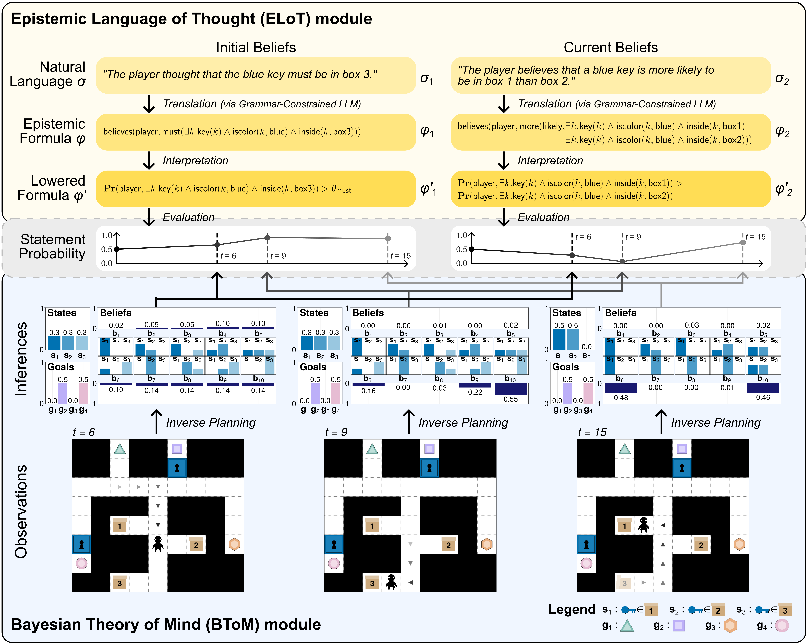

# Language-augmented Bayesian Theory of Mind (LaBToM)

A Bayesian cognitive model of epistemic language understanding, which translates natural language into an epistemic language-of-thought (ELoT), then evaluates these translations against inferences about an agent's mental states produced by inverse planning with a Bayesian theory of mind (BToM).

This dataset and model were largely authored by [Lance Ying](https://www.lanceying.com/) and [Tan Zhi-Xuan](https://ztangent.github.io/).

See [the paper](https://arxiv.org/abs/2408.12022) for more details:

> Lance Ying*, Tan Zhi-Xuan*, Lionel Wong, Vikash Mansinghka, and Joshua B. Tenenbaum. 2025. **“Understanding Epistemic Language with a Language-augmented Bayesian Theory-of-Mind,”** in Transactions of the Association for Computational Linguistics (TACL).

## Overview

Our LaBToM model comprises two interlinked modules:
- The first module (top), an **epistemic language of thought (ELoT)**, models our capacity to compositionally represent the world (including the contents of others' minds), and how we flexibly translate such thoughts from natural language.

- The second module (bottom), a **Bayesian theory-of-mind (BToM)**, captures our intuitive inferences about others' minds via Bayesian inference over a generative model of how agents update their beliefs and act towards their goals.

Epistemic language understanding can thus be modeled by mapping language into ELoT formulas, which we evaluate against the inferences produced by rational mentalizing.

<p align="center">

</p>

## Setup

To set up the environment for this project, make sure the `epistemic_language` directory is set as the active environment. In VSCode with the Julia for VSCode extension, you can do this by right-clicking the directory in the file explorer, and selecting `Julia: Activate This Environment`. Alternatively, you can use the `activate` command in the Julia REPL's `Pkg` mode.

Then run the following commands in via `Pkg` mode in the Julia REPL:

```julia-repl
add https://github.com/probcomp/InversePlanning.jl.git#release-0.0.2
instantiate
```

Several scripts in this repository (e.g. threshold fitting, analysis, and plotting code) require access to human-provided data. This data can be downloaded from the files tab of https://osf.io/xq9c4/, and placed in `results/humans` directory.

## Project Structure

### Directories

- The `dataset` directory contains all plans, problems, and stimuli
- The `src` directory contains non-top-level source files
- The `scripts` directory contains the main experiment scripts
- The `translation` directory contains ELoT translation code (see `translation/README.md`)
- The `llm_baselines` directory contains LLM baselines (see `llm_baselines/README.md`)
- The `assets` directory contains image assets used in this README

### Main Experiment Scripts

In the `scripts` directory, you will find the following scripts:

- `run_btom_inference.jl` generates and saves BToM inference results via Bayesian inverse planning
- `run_elot_evaluation.jl` evaluates ELoT translations against saved BToM inference results
- `run_elot_evaluation_full.jl` evaluates ELoT translations for the full dataset of human-written statements
- `run_inference_and_evaluation.jl` runs the BToM and ELoT modules consecutively, without intermediary files
- `run_threshold_fitting.jl` fits threshold parameters for the ELoT module against human data
- `testbed.jl` is for experimenting with modeling and inference parameters
- `stimuli.jl` generates stimuli animations and metadata

### Analysis and Plotting

Scripts for analysis and plotting can also be found in the `scripts` directory:

- `analysis.jl` generates analysis results
- `plot_statistics.jl` generates statistical plots from the analysis results
- `plot_storyboards.jl` generates storyboards with results for each scenario/stimulus
